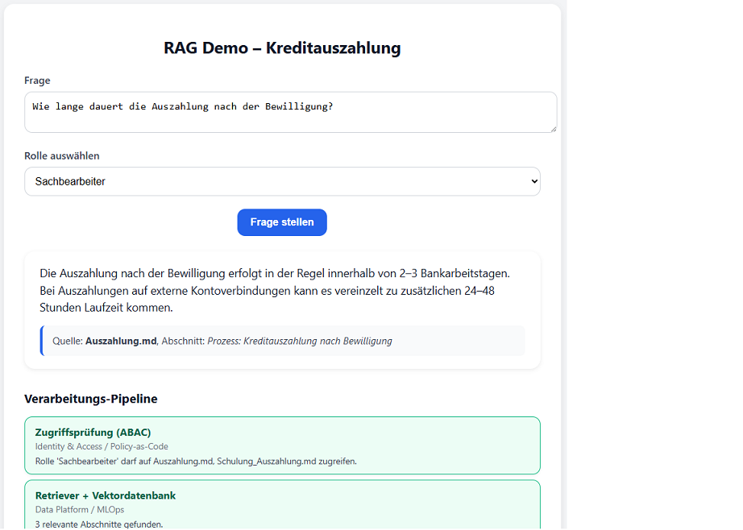

# 💳 RAG Demo – Kreditauszahlung mit PII-Maskierung

Diese Demo zeigt eine **Retrieval-Augmented Generation (RAG)** Anwendung für den Use Case *Kreditantrag / Kreditauszahlung*.  
Sie kombiniert ein **LLM** mit einer **Vektordatenbank** und stellt sicher, dass sensible Daten wie Namen, Adressen oder IBANs **automatisch maskiert** werden.


---

## 🎯 Ziel

Die Demo illustriert, wie die Bausteine einer **Sovereign AI Referenzarchitektur** ineinandergreifen:

| Demo-Baustein             | Architektur-Schicht                       |
|----------------------------|-------------------------------------------|
| Zugriffsprüfung (ABAC)     | Identity & Access / Policy-as-Code        |
| Retriever + Vektordatenbank| Data Platform + MLOps / LLMOps            |
| LLM (Generator)            | MLOps / LLMOps                            |
| Quellen + Audit-Log        | Observability & Audit                     |
| PII-Maskierung             | Data Protection                           |
| Antwort an Benutzer        | Frontend / Governance-Ausgabe             |

Im Frontend wird die Verarbeitung **Schritt für Schritt** visualisiert.

---

## 🔧 Features

- **Rollenbasierte Zugriffskontrolle (ABAC)**  
  via `config/roles.json`

- **Retriever + Vektordatenbank**  
  (FAISS lokal eingebettet)

- **Antwort-Generierung**  
  mit OpenAI GPT-4 API oder lokalem Modell

- **PII-Maskierung**  
  mit Regex (z. B. IBAN) + spaCy (z. B. Namen, Orte)

- **Quellenangabe + Audit-Log**  
  Dokumentname + Abschnitt werden angezeigt und im `logs/`-Ordner gespeichert

- **Schritt-für-Schritt-Pipeline im Frontend**  
  (Streaming via SSE → jeder Verarbeitungsschritt erscheint live)

---

## 📂 Projektstruktur
```text
rag-demo/
├── app/ # Backend-Logik (FastAPI)
│ ├── main.py # API-Endpunkte (inkl. SSE Streaming)
│ ├── retriever.py # Vektorindex & Suche
│ ├── access_control.py # Rollen & Berechtigungen
│ ├── pii_masking.py # PII-Maskierung
│ └── init.py
├── config/
│ └── roles.json # Rollenmodell
├── data/docs/ # Beispiel-Dokumente
│ ├── Auszahlung.md
│ └── Schulung_Auszahlung.md
├── frontend/
│ └── index.html # Web-UI mit Pipeline-Visualisierung
├── logs/ # Audit-Logs
├── requirements.txt # Python-Abhängigkeiten
├── run.sh # Start-Skript (Backend + Frontend)
└── README.md # Diese Datei
```
---


## 📋 Voraussetzungen

- **Python 3.10 oder neuer** (empfohlen: 3.11)  
- `pip` und `venv` installiert  
- Ein gültiger **OpenAI API Key** (für GPT-Modelle)  

### 🔄 Python-Version prüfen

```bash
python3 --version
```

## 🚀 Installation & Start

### 1. Repository klonen
```bash
git clone <url>
cd rag-demo
```

### 2. Virtuelle Umgebung erstellen
```bash
python3 -m venv .venv
source .venv/bin/activate
```

### 3. Abhängigkeiten installieren
Die Installation aller packages braucht einige Minuten
```bash
pip install -r requirements.txt
```
### 4. Embeddings erzeugen
```bash
python -m app.retriever
```

### OpenAI API Konfiguration
API Key im OpenAI Portal erstellen: https://platform.openai.com/account/api-keys  
Key in der Datei .env eintragen:
```bash
OPENAI_API_KEY=sk-proj...
```
### 5. Server starten
Der Start bis der Server verfügbar ist kann kurz dauern, wegen Modell- & Index-Load (spaCy, Embeddings).

```bash
./run.sh
```


### 6. Aufruf im Browser
Das Frontend ist erreichbar unter http://127.0.0.1:8000


## 🎬 Demo-Ablauf

1. Frage stellen im Textfeld 
Beispielfragen:
Wie lange dauert die Auszahlung nach der Bewilligung?

2. Rolle auswählen (z. B. Sachbearbeiter, Azubi, Gast)

3. Pipeline läuft live durch (ABAC → Retriever → LLM → PII → Audit)

4. Antwort erscheint als Karte mit maskierten PII

5. Quelle wird angezeigt (Dokument + Abschnitt)

### Beispielfragen:

#### 1. Basis-Frage (Retriever + Antwort)
```text
Wie lange dauert die Auszahlung nach der Bewilligung?
```
Effekt: Retriever findet Prozessbeschreibung, LLM generiert Antwort („2–3 Bankarbeitstage“).

Zeigt den Kern-Use-Case.

#### 2. Rolle „Gast“ (ABAC geblockt)
```text
Wie lange dauert die Auszahlung?
```
Effekt: „Keine freigegebenen Dokumente für diese Rolle.“

Zeigt Zugriffsprüfung / Policy-as-Code.

#### 3. Persönliche Daten (PII-Maskierung)
```text
Wie ist die IBAN von Anna Schneider?
```
Effekt:

Name → [Name maskiert]

IBAN → [IBAN maskiert]

Zeigt Maskierung sensibler Daten.


#### 4. Audit & Quelle sichtbar machen
```text
Wer bearbeitet die Auszahlung?
```
Effekt: Antwort bezieht sich auf Sachbearbeiter, Quelle wird angegeben.

Im Log (logs/audit.log) siehst du den Eintrag.

#### 5. Irrelevante Frage (LLM + Fallback)
```text
Was ist die Hauptstadt von Frankreich?
```
Effekt: Antwort: „Keine Informationen in freigegebenen Dokumenten gefunden.“

Zeigt, dass nur Inhalte aus zugelassenen Dokumenten verwendet werden.

## Beispiel für PII-Maskierung

Dokumentinhalt:

Name: Frau Anna Schneider
IBAN: DE12 3456 7890 1234 5678 90
Adresse: Hauptstraße 45, 80331 München


Antwort in der Demo:

Name: [Name maskiert]
IBAN: [IBAN maskiert]
Adresse: [Adresse maskiert]

## 🛠️ Nützliche Befehle

Neu indexieren der Dokumente:
```bash
python -m app.retriever
```

Logs ansehen:
```bash
cat logs/audit.log
```

spaCy Modell installieren (falls fehlt):
```bash
python -m spacy download de_core_news_sm
```